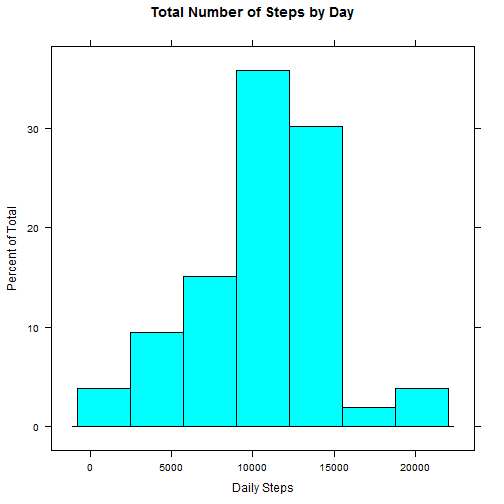
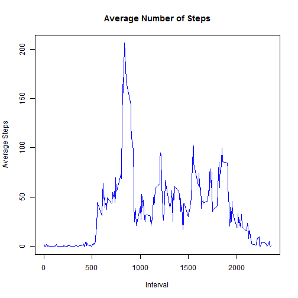
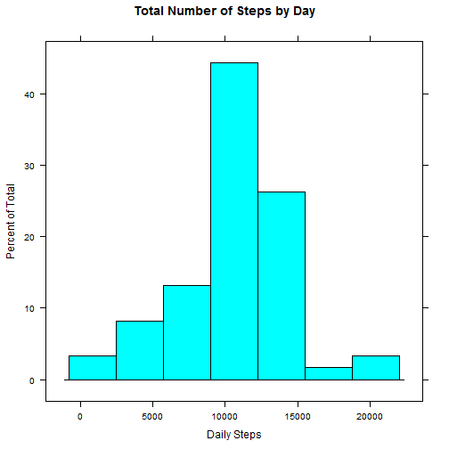
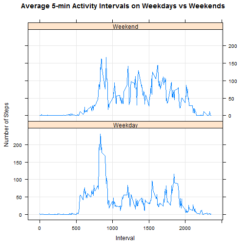

## Reproducible Research: Peer Assessment 1

### Loading and preprocessing the data


```r
activity<-read.csv("activity.csv" , header=TRUE)
head(activity)
```

```
##   steps       date interval
## 1    NA 2012-10-01        0
## 2    NA 2012-10-01        5
## 3    NA 2012-10-01       10
## 4    NA 2012-10-01       15
## 5    NA 2012-10-01       20
## 6    NA 2012-10-01       25
```


```r
library(lattice)
activity$date<-as.Date(activity$date,format = '%Y-%m-%d')
```

### What is mean total number of steps taken per day?


```r
TotalStepsByDay <-aggregate(steps~date, data=activity,sum, na.rm=TRUE)
head(TotalStepsByDay)
```

```
##         date steps
## 1 2012-10-02   126
## 2 2012-10-03 11352
## 3 2012-10-04 12116
## 4 2012-10-05 13294
## 5 2012-10-06 15420
## 6 2012-10-07 11015
```


```r
histogram(TotalStepsByDay$steps, main="Total Number of Steps by Day", xlab="Daily Steps")
```

 


On average, the number of steps taken per day is 1.0766189 &times; 10<sup>4</sup> and the median is 10765 


### What is the average daily activity pattern?


```r
AverageStepsByInterval <-aggregate(steps~interval, data=activity, mean, na.rm=TRUE)
plot(AverageStepsByInterval$interval, AverageStepsByInterval$steps, type="l",xlab="Interval",ylab="Average Steps", main="Average Number of Steps",col="blue")
```

 


```r
maxSteps<-AverageStepsByInterval$interval[which.max(AverageStepsByInterval$steps)]
```

on average, the 5-minute interval that contains the maximum number of steps is 835

### Imputing missing values


```r
sum(is.na(activity$steps))
```

```
## [1] 2304
```
We replace the NAs with the average number of steps by interval calculated before on the same interval.


```r
activityNoNA <- activity
for(i in 1:nrow(activityNoNA)){
  if (is.na(activityNoNA$steps[i])) {
    replace <- AverageStepsByInterval$steps[AverageStepsByInterval$interval == activityNoNA$interval[i]];
    activityNoNA$steps[i] <- replace;
  }
}

sum(is.na(activityNoNA$steps))
```

```
## [1] 0
```


```r
TotalStepsByDayNoNA <- aggregate(steps ~ date, data=activityNoNA, sum)
histogram(TotalStepsByDayNoNA$steps, main="Total Number of Steps by Day", xlab="Daily Steps")
```

 

The total number of steps increased around the mean as a result of replacing the missing values.


```r
mean(TotalStepsByDayNoNA$steps, na.rm=TRUE)
```

```
## [1] 10766.19
```


```r
median(TotalStepsByDayNoNA$steps, na.rm=TRUE)
```

```
## [1] 10766.19
```
The mean and median have very slightly increased.

### Are there differences in activity patterns between weekdays and weekends?


```r
activityNoNA$day <- "Weekday"
activityNoNA$day[weekdays(as.Date(activityNoNA$date), abb=T) %in% c("Sat","Sun")]<-"Weekend"
table(activityNoNA$day)
```

```
## 
## Weekday Weekend 
##   12960    4608
```


```r
TotalStepsByIntervalNoNADay <- aggregate(steps ~ interval + day, data=activityNoNA, FUN="mean")
xyplot(steps ~ interval | day, data=TotalStepsByIntervalNoNADay, type="l", grid=T, layout=c(1,2), ylab="Number of Steps", xlab="Interval", main="Average 5-min Activity Intervals on Weekdays vs Weekends")
```

 
